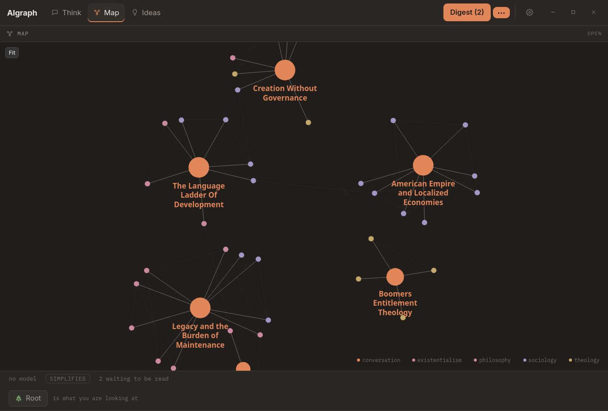
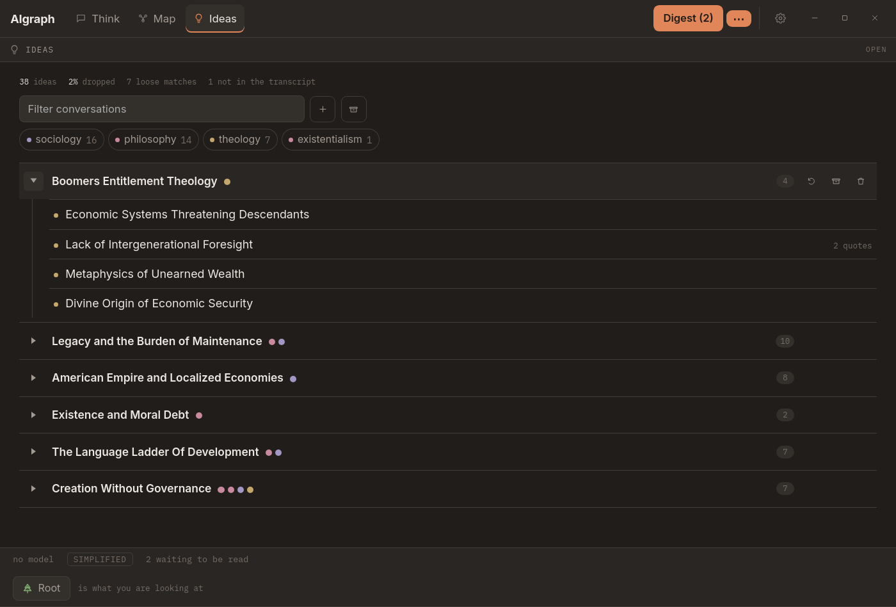
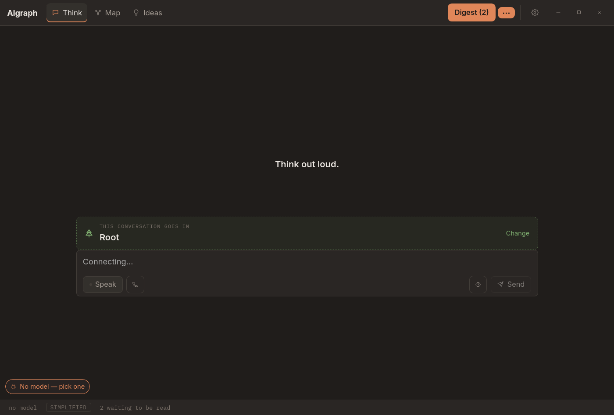

# AIgraph

Think out loud. Get a map back.

You talk to a model. When you press Done the transcript is archived and the
ideas in what you said become dots on a map you can walk around. Every idea
links back to the exact words it came from, highlighted in place, so nothing on
the map is something you have to take on faith.

The map is the product. The chat is what gets it out of your head.

Free, open source, local-first: it runs a model on your own machine by default,
and nothing said to it has to leave.




*The map. Large dots are conversations, small ones the ideas taken from them,
coloured by subject. An idea you returned to is shared between the
conversations it came up in, which is the only thing that links one to
another.*



*What came out of each conversation. The line at the top is the honesty metric:
how many ideas were recorded, and how many were thrown away because their quote
could not be found in what you actually said.*



*Where you talk. The chip at the bottom left is which model is answering — the
app opens here rather than on a setup screen.*

## Install

**Linux** — download the `.AppImage`, make it executable, run it:

```bash
chmod +x AIgraph_*.AppImage
./AIgraph_*.AppImage
```

Or the `.deb` on Debian and Ubuntu, or the `.rpm` on Fedora:

```bash
sudo apt install ./AIgraph_*_amd64.deb
```

**Windows 10 and 11** — download the `-setup.exe` and run it. It installs for
the current user, so it needs no administrator.

Downloads are on the [releases page][releases]. Nothing else is required: the
app fetches a model and an engine on first run if you ask it to.

[releases]: https://github.com/TheRobberPanda/aigraph/releases

### First run

The app opens on the conversation with nothing to talk to, and the chip at the
bottom left says so. Press it and pick one:

- **Local** — the app downloads a model (about 4 GB) and an engine and runs
  them itself. Nothing else to install.
- **LM Studio** or **Ollama** — if you already run one, whatever it has loaded
  is used automatically.
- **Cloud API** — Claude, or anything speaking the same API. Transcripts leave
  this machine, and the app says so where you choose it.

On Linux the app needs a GPU build of the engine to be quick. Install it in
**Settings → The engine**; the CPU build works everywhere and is roughly twenty
times slower at reading a prompt.

## What it does

**Talk, then press Done.** The transcript is archived to SQLite and to plain
markdown in a folder you choose, so your thinking is never trapped in this
app's database.

**Ideas are extracted with their receipts.** A model reads the conversation
back and reports each idea with a verbatim quote. The quote is then located by
exact string search in your own turns — model-reported offsets are never
trusted — and an idea whose quote cannot be found is *discarded*, not shown.
The Ideas view reports how often that happens, because a drop rate nobody looks
at is a drop rate nobody fixes.

**The same thought said twice becomes one dot.** Saying "Trump is a bad man"
and later "he's not a bad guy, he acts like one sometimes" rewrites the first
claim rather than making two dots, keeps both quotes as evidence, and keeps the
old wording one click from being restored. Over-merging is worse than
under-merging, so it only merges when confident and draws a faint line
otherwise.

**The map.** Conversations are large dots, ideas are small ones, and an idea
you returned to is shared between the conversations it came up in — which is
the only thing that links one conversation to another, and it means something
precise. Click a node to fly to it and name what it touches; pin a subject in
the legend to pick it out; right-click to archive, re-read or delete.

**Folders** scope everything — the map, the ideas, the conversations, and what
the chat is allowed to recall.

**Talking rather than typing.** Dictation puts phrases in the composer for you
to edit; it never sends by itself, because a misheard word would become a quote
attributed to you that you never said. Call mode is the exception you ask for:
one press, a waveform, and it sends when you stop talking.

**Your language, not English.** If you think in Polish, the titles, claims and
notes come back in Polish, and quotes are copied rather than translated.

## Models

Local by default. The app can run a model itself, or use LM Studio or Ollama
if you already have one — either way it needs no account, no key, and no
network.

Two roles, chosen separately in the model panel:

- **The model you talk to.** Never given instructions about this app.
- **The model that reads it back.** A mechanical, structured job; a small fast
  model usually does fine, and reasoning models are a poor fit (see below).

Remote options, both optional:

- **Anthropic API** — paste a key under **Cloud API**. Stored in your system
  keychain, never in the settings file, and checked against the API before it is
  saved. Models are listed live from the key.
- **`claude` CLI** — if the command is installed, your Claude Pro or Max
  subscription can be used without an API key. Worth being straight about: this
  rides a plan intended for interactive use, and Anthropic could reasonably
  tighten that at any time. It is never the default. (MCP cannot do this — it
  carries tools, not inference.)

Anything remote is labelled **leaves this machine** where you choose it.

## Building it yourself

```bash
npm install
npm run package
```

`npm run package` is `tauri build` with `LD_LIBRARY_PATH` pointing at the build
directory. The AppImage step resolves shared libraries by scanning the loader
path, and the speech runtimes are not on it — they sit beside the binary and
are found at run time through an `$ORIGIN` rpath. Without it everything builds
and then the last step fails with *Could not find dependency:
libsherpa-onnx-c-api.so*.

Produces a `.deb`, an `.rpm` and an `.AppImage` under
`src-tauri/target/release/bundle/` on Linux, and an installer and an `.msi` on
Windows. Tagged releases build all of them in CI — Windows installers cannot be
cross-compiled from Linux, so the matrix in `.github/workflows/release.yml` is
the only way to produce them.

Both Linux packages carry the sherpa-onnx and onnxruntime shared libraries, and
the binary is linked with an `$ORIGIN` rpath so it finds them once installed.
Without that the packages build cleanly and then fail at startup with *error
while loading shared libraries* — worth knowing if you change how speech
recognition is linked.

Build dependencies on Debian and Ubuntu:

```bash
sudo apt install libwebkit2gtk-4.1-dev libasound2-dev clang libclang-dev \
                 librsvg2-dev patchelf
```

ALSA is for the microphone and clang is for the speech bindings' bindgen step.
Neither failure message mentions audio or speech, so leaving them out sends
anyone debugging it a long way in the wrong direction.

## Design

Warm ink ground, cool machine accents — the inverse of the usual dark UI, because
this gets used alone and late, on things that matter. The palette carries the
product's ethic: **warm is you** (ivory text, gold for ideas you return to),
**cool is the machine** (dusty blue, sage and brick for its opinions).

Type carries the same split. **Your words are set in a reading serif**, because
they are the document and are preserved verbatim; everything the app and the
model say is set in a compact sans, because it is apparatus; numbers and
diagnostics are mono, because they are instrument readings. You can tell whose
voice you are looking at without reading a word.

## Dictation

Press **Speak** and talk. Phrases land in the composer on each pause; you edit
before sending. Deliberately: speech that sends itself would turn every
transcription error into a quote attributed to you that you never said — the one
failure mode the quote verifier cannot catch.

The speech model (~488MB) downloads on first use.

**Model: NVIDIA Parakeet TDT 0.6B v3** (CC-BY-4.0) via sherpa-onnx, chosen over
Whisper because it runs fast on **CPU** — the chat model already contends for the
GPU. Measured here at 28–48× real time, correctly transcribing English, Spanish
and German with no language setting. Silero VAD segments on silence.

### Choosing an extraction model

Use a **non-reasoning** model, or one whose reasoning can be disabled. Extraction
is a mechanical structured task, and a reasoning model will otherwise spend its
whole token budget thinking and return nothing — an empty answer after several
minutes. The app sends `reasoning_effort: "none"` (and Ollama's `think: false`)
to prevent this, and falls back gracefully on servers that reject it. On
gemma-4-12b-qat this was the difference between a ten-minute failure and a
52-second extraction.

## Requirements

To *use* AIgraph you need nothing but the installer — see [Install](#install).
The rest of this section is for building it.

- Linux or Windows 10+ (macOS should build; it is untested here)
- Rust 1.77+, Node 18+

Tauri system dependencies on Debian/Ubuntu/Mint:

```bash
sudo apt install -y libwebkit2gtk-4.1-dev build-essential curl wget file \
  libxdo-dev libssl-dev libayatana-appindicator3-dev librsvg2-dev pkg-config \
  libasound2-dev clang libclang-dev
```

The last three are for dictation: ALSA headers for microphone capture, and
libclang for the speech library's bindgen step. Neither failure message mentions
audio or speech, so leaving them out produces a confusing wall.

## Running

```bash
npm install
npm run tauri dev
```

## Local model setup

The app finds your server automatically. If both are running, it asks which to
use rather than guessing — the model shapes what ends up in your diagram, so
that choice is yours.

### Fitting a model on a small GPU

Two settings decide whether a model loads and whether extraction works. Both
caused real failures during development on a 12 GB RTX 3060. The app's own
engine exposes them in the model panel, under **Set them for speed**; the notes
below are for driving LM Studio directly.

- **GPU offload.** Full offload (`--gpu max`) crashes partway through loading
  when the model plus its KV cache exceeds VRAM. The error — `Engine protocol
  runtime llama-server exited before becoming healthy` — does not mention
  memory. Lower the ratio until it loads.
- **Parallel slots.** LM Studio divides the context window across slots, so
  `--parallel 4` with a 4864-token context leaves only ~1200 tokens per request.
  Extraction over a real conversation exceeds that and fails with a bare
  `400 {"error":"terminated"}`, which also does not mention context. Use
  `--parallel 1` unless you need concurrency.

A configuration that works on 12GB:

```bash
lms load google/gemma-4-12b-qat --gpu 0.5 --context-length 8192 --parallel 1
```

## Transparency about AI

This project uses LLMs deliberately and says so plainly:

- **Your ideas are extracted by a model**, not by you. It can misread you. Every
  idea therefore links back to your exact words, so you can always check the map
  against the territory.
- **Ideas that cannot be traced are discarded.** The model must quote you
  verbatim; if we cannot find that quote in what you actually wrote, the idea is
  dropped rather than shown. The drop rate is displayed in the app rather than
  hidden, because it is the honest measure of how well this is working.
- **Nudges are the model's opinion**, not yours. They are visually marked as AI
  and never enter the graph as ideas.
- **The chat is not steered.** No system prompt, no retrieved context, no tools.
  This is enforced by a test (`src-tauri/tests/chat_purity.rs`), not by good
  intentions. If that ever changes, it will be a documented product decision.
- **Reasoning models' chain-of-thought is shown but never stored** and never
  extracted from.
- **This code was written with AI assistance.**

## Testing

```bash
cargo test --manifest-path src-tauri/Cargo.toml
```

Tests that need a running model server are `#[ignore]` by default:

```bash
IDEA_GRAPH_MODEL=google/gemma-4-12b-qat \
  cargo test --manifest-path src-tauri/Cargo.toml --test lmstudio_live -- --ignored --nocapture
```

## License

AGPL-3.0-or-later.

## Privacy

Everything is on your machine: the database, the transcripts, and the model, if
you let the app run one. Nothing is sent anywhere unless you pick a Cloud API,
and the app says **leaves this machine** at the point where you pick it.

There is no telemetry, no analytics, no crash reporting and no update check.

API keys go in your operating system's keychain, never in the settings file.
