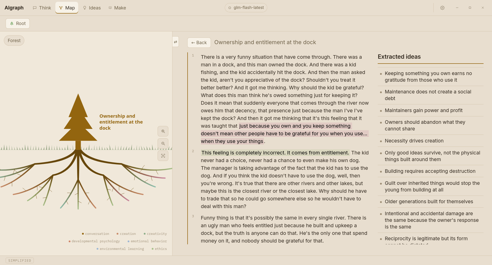
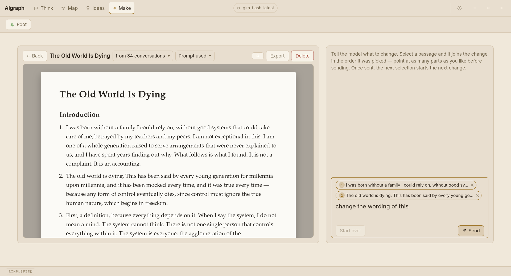
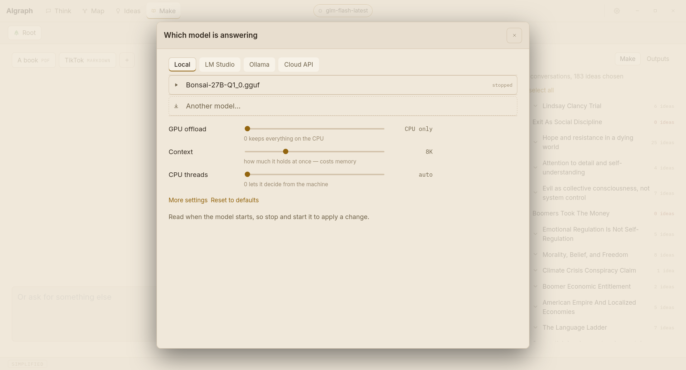

# AIgraph

AIgraph is a desktop app for thinking out loud with a language model. You talk
or type. When you press **Done**, a model reads the conversation back and pulls
out the ideas you stated. Each idea becomes a node on a map, and each node links
to the exact sentence you said it in.

It is free, open source (AGPL-3.0), and runs on Linux and Windows. By default
the model runs on your own machine, so nothing you say has to leave it.

**[Download the latest release][latest]** · [All releases][releases] ·
[Changelog](CHANGELOG.md)

[latest]: https://github.com/TheRobberPanda/AIgraph/releases/latest
[releases]: https://github.com/TheRobberPanda/AIgraph/releases



*One conversation on the map. The tree is the conversation and each root ends
in an idea taken from it, coloured by subject. On the right is the transcript,
with the words each idea came from highlighted, and the list of ideas.*


*Where you talk. Past conversations in the folder are listed on the right with
how many turns and ideas each has; the arrow picks one up where it left off.*


*Everything taken from the folder, grouped by conversation. The subject chips
at the top filter the list.*



*Make. A document written from 34 conversations. Select passages on the page,
tell the model what to change, and export it as PDF, Word, slides or
Markdown.*

## What it does

**Talk, then press Done.** The conversation is saved to a local SQLite database
and as a plain markdown file in a folder you choose. You can read your
transcripts without the app.

**Every idea has a quote.** The model that reads the conversation must quote
you word for word for each idea it reports. The app then searches your own
turns for that quote. If the quote isn't there, the idea is thrown away. The
Ideas tab shows how many were kept and how many were dropped.

**Repeated thoughts merge.** If you say something in March and a sharper
version of it in May, the two become one idea with both quotes attached. The
wording updates to the newer version, and the old one is a click away. When the
model isn't confident the two are the same thought, it links them instead of
merging them.

**The map.** Conversations and their ideas, laid out as a forest, a sunflower
field, a galaxy, a neuron or plain rings. An idea that came up in two
conversations connects them. Click a node to open it; right-click to move,
archive, re-read or delete it. Deleted things go to a bin and can be restored.

**Arguing back.** The model leaves notes on each idea: what holds up and what
doesn't. You can answer any note, typed or spoken. Your answer is kept next to
the idea as a smaller node on the map.

**Make.** Pick conversations or ideas and ask for something built from them:
an essay, a talk, a book of the whole folder. It exports as Markdown, PDF, Word
or slides.

**Import.** Bring in a document, an Obsidian vault, or your Claude
conversations, and they are read into ideas the same way.

**Folders** keep separate projects apart. The map, the ideas list and what the
chat can recall all follow the folder you are in.

**Speech.** Dictation fills the composer and waits for you to edit and send.
It never sends on its own, because a misheard word would become a quote you
never said. Call mode is the exception: you turn it on, and it sends when you
stop talking. Speech recognition runs locally on the CPU with NVIDIA Parakeet
TDT 0.6B v3 (a 488 MB download on first use).

**Your language.** If you think in Polish, titles, claims and notes come back
in Polish. Quotes are copied, never translated.

## Install

Download from the [latest release][latest].

**Linux** (glibc 2.38 or newer: Ubuntu 24.04, Debian 13, Fedora 39 and later).
The AppImage runs anywhere:

```bash
chmod +x AIgraph_*_amd64.AppImage
```

```bash
./AIgraph_*_amd64.AppImage
```

Or install the `.deb` on Debian and Ubuntu:

```bash
sudo apt install ./AIgraph_*_amd64.deb
```

Or the `.rpm` on Fedora.

**Windows 10 and 11.** Run `AIgraph_*_x64-setup.exe`. It installs for the
current user and doesn't need administrator rights. An `.msi` is also provided.

**macOS** isn't built or tested.

### First run

The app opens on the chat with no model connected. Click the model pill at the
top and pick one:

- **Local.** The app downloads a model (about 4 GB) and a llama.cpp engine and
  runs them itself. On Linux, install the GPU build under **Settings → The
  engine**; the CPU build works everywhere but reads prompts about twenty times
  slower.
- **LM Studio or Ollama.** If one is running, the app finds it and uses the
  loaded model.
- **Cloud API.** Anthropic, OpenRouter or any OpenAI-compatible endpoint. Your
  transcripts are sent to that provider, and the app labels the option
  **leaves this machine**. Keys are stored in the system keychain.
- **`claude` CLI.** If it is installed, a Claude Pro or Max subscription can be
  used without an API key. This uses a plan meant for interactive use, and
  Anthropic may restrict it. It is never the default.



The chat model and the model that reads conversations back are chosen
separately. For reading back, use a model without reasoning, or one where
reasoning can be switched off. Reasoning models tend to spend the whole token
budget thinking and return nothing.

## Privacy

The database, transcripts and (if you choose) the model all stay on your
machine. Nothing is sent anywhere unless you pick a cloud provider. There is no
telemetry, analytics, crash reporting or update check.

## How the AI is used

- Ideas are extracted by a model, and it can misread you. That is why every
  idea links to your exact words and untraceable ideas are dropped.
- The model you chat with receives your conversation and one fixed
  instruction that is the same for everyone. Nothing extracted from your
  thinking is added, except idea titles if you turn on recall. A test
  (`src-tauri/tests/chat_purity.rs`) enforces this.
- A reasoning model's chain of thought is shown while it works, but it is
  never stored and never read for ideas.
- The code was written with AI assistance.

## Building from source

You need Rust 1.77+, Node 18+, and on Debian or Ubuntu:

```bash
sudo apt install -y libwebkit2gtk-4.1-dev build-essential curl wget file \
  libxdo-dev libssl-dev libayatana-appindicator3-dev librsvg2-dev pkg-config \
  patchelf libasound2-dev clang libclang-dev
```

ALSA is for the microphone and clang for the speech library's bindings. If
either is missing, the build error mentions neither audio nor speech.

Run in development:

```bash
npm install && npm run tauri dev
```

Build installers:

```bash
npm run package
```

This produces a `.deb`, `.rpm` and `.AppImage` under
`src-tauri/target/release/bundle/` on Linux, or an `.exe` and `.msi` on
Windows. `npm run package` is `tauri build` with `LD_LIBRARY_PATH` set so the
AppImage step can find the bundled speech libraries. Without it the last step
fails with *Could not find dependency: libsherpa-onnx-c-api.so*. Windows
installers can't be cross-compiled; tagged releases build both platforms in
`.github/workflows/release.yml`.

### Tests

```bash
cargo test --manifest-path src-tauri/Cargo.toml
```

Tests that need a running model are ignored by default:

```bash
IDEA_GRAPH_MODEL=google/gemma-4-12b-qat \
  cargo test --manifest-path src-tauri/Cargo.toml --test lmstudio_live -- --ignored --nocapture
```

### Running a model on a 12 GB GPU with LM Studio

Two settings caused most failures during development on an RTX 3060:

- **GPU offload.** Full offload crashes during loading when the model and its
  cache don't fit in VRAM, with an error that doesn't mention memory
  (`llama-server exited before becoming healthy`). Lower the ratio.
- **Parallel slots.** LM Studio splits the context window between slots.
  `--parallel 4` with an 8K context leaves 2K per request, and extraction fails
  with a bare `400 {"error":"terminated"}`. Use `--parallel 1`.

```bash
lms load google/gemma-4-12b-qat --gpu 0.5 --context-length 8192 --parallel 1
```

## License

AGPL-3.0-or-later. Bundled Noto Serif is under the SIL Open Font License.
